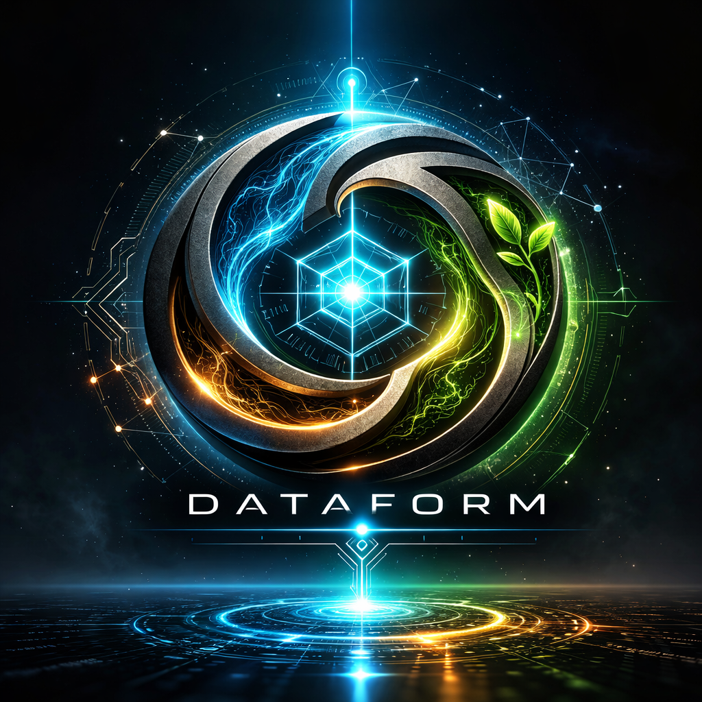

<p align="center">
  
</p>

<h1 align="center">DATAFORM</h1>
<h3 align="center">Darwinian Adaptive Trait-Assimilating Form</h3>

<p align="center">
  A local-first AI companion that learns its user over decades through evolutionary personality adaptation.
</p>

---

## What is DATAFORM?

DATAFORM is a desktop AI assistant that doesn't just respond — it **remembers**, **learns**, and **evolves**. Unlike cloud-based AI that forgets you between sessions, DATAFORM builds a persistent model of who you are: your values, preferences, communication style, and goals.

All data stays on your machine. No telemetry. No cloud sync. Your personality model belongs to you.

### Core Concept

DATAFORM uses a biologically-inspired pipeline:

- **Episodic Memory** — Every conversation is stored locally with encrypted SQLite databases
- **Trait Extraction** — An LLM analyzes your conversations to extract stable personality traits (values, preferences, motivations)
- **LoRA Training** — A personal neural network adapter trains on your data during idle time
- **Darwinian Evolution** — Multiple adapter variants compete; the best-performing ones survive and reproduce
- **Decade-Scale Lifecycle** — Schema migration, health checks, and data lifecycle management designed for years of continuous use

## Features

**Conversational Intelligence**
- Multi-provider LLM support (Ollama, LM Studio, OpenAI, Anthropic)
- Context-aware responses using trait memory, mood tracking, and semantic recall
- Curiosity engine that asks genuine follow-up questions

**Autonomous Background Processing**
- Idle-time research — DATAFORM searches the web and summarizes findings on topics you care about
- News awareness — Fetches headlines and starts conversations about stories relevant to your interests
- Goal tracking — Detects goals from conversation and checks in on progress
- Sentiment analysis — Tracks mood trends and adjusts conversational tone
- Learning plans — Generates multi-session curricula on topics you want to explore

**Proactive Dialog**
- Generates thoughts during idle time from research, curiosity, and training
- Surfaces conversation starters via a notification badge
- Reminders parsed from natural language ("remind me to...")
- Daily digest of pending thoughts

**Personality Evolution**
- Population-based LoRA adapter training with mutation and crossover
- Evaluation suite scoring identity alignment, curiosity quality, and stability
- Automatic promotion of best-performing personality variants
- Full adapter lineage tracking across generations

**Privacy & Longevity**
- AES-256-CBC encryption for all databases
- Profile health checks with self-healing and backup rotation
- Episode compaction, trait confidence decay, and checkpoint pruning
- Schema versioning with forward migration for decade-scale data integrity

## Architecture

```
Qt6/QML Desktop App (C++17)
├── Orchestrator          — Cognitive loop: input → context → LLM → memory
├── MemoryStore           — Dual encrypted SQLite (episodic + traits)
├── EmbeddingManager      — Semantic vector search via Ollama embeddings
├── LLMProviderManager    — Multi-provider with background request queue
├── TraitExtractor        — LLM-based personality trait extraction
├── WhyEngine             — Curiosity controller with budget/cooldown
├── ThoughtEngine         — Proactive dialog generation
├── SentimentTracker      — Per-episode mood analysis with trend detection
├── GoalTracker           — Goal detection and periodic check-ins
├── ResearchEngine        — Autonomous web research pipeline
├── NewsEngine            — Headline fetch and discussion generation
├── LearningEngine        — Multi-session learning plan curricula
├── ReminderEngine        — Natural language reminder parsing
├── ReflectionEngine      — Idle-time LoRA training pipeline
├── EvolutionEngine       — Population-based adapter selection
├── AdapterManager        — Versioned LoRA adapter management
├── ProfileHealthManager  — Integrity checks and backup/restore
├── DataLifecycleManager  — Compaction, decay, and pruning
└── LineageTracker        — Adapter genealogy and era timeline
```

## Building

### Prerequisites

- **Qt 6.10+** with Quick, Qml, Network, Sql, Charts modules
- **CMake 3.21+**
- **MSVC 2022** (Windows)
- **Ollama** running locally (recommended default provider)

### Build

```bash
# Standard build
cmake -B build -DCMAKE_PREFIX_PATH="C:/Qt/6.10.1/msvc2022_64"
cmake --build build --config Release

# With LoRA training support (requires ONNX Runtime Training)
cmake -B build -DCMAKE_PREFIX_PATH="C:/Qt/6.10.1/msvc2022_64" -DDATAFORM_ENABLE_TRAINING=ON
cmake --build build --config Release
```

### Run

```bash
build/Release/Dataform.exe
```

Ensure Ollama is running with a model pulled (e.g., `ollama pull qwen3:8b`).

## Project Status

DATAFORM is in active development. Completed phases:

| Phase | Description | Status |
|-------|-------------|--------|
| 0 | Foundations — memory, orchestrator, idle scheduler | Done |
| 1 | Curiosity engine + trait assimilation | Done |
| 2 | Native LoRA training via ONNX Runtime | Done |
| 3 | Darwinian evolution engine | Done |
| 4 | Decade-scale lifecycle management | Done |
| 5 | Autonomous idle-time web research | Done |
| 6 | Personal model pipeline (Side LLM) | Done |
| 7 | Semantic memory + expanded training | Done |
| + | Conversation history, proactive dialog, news, reminders, goals, mood tracking, learning plans | Done |

## License

**Free for personal use.** Commercial use requires a separate license. See [LICENSE](LICENSE) for details.
